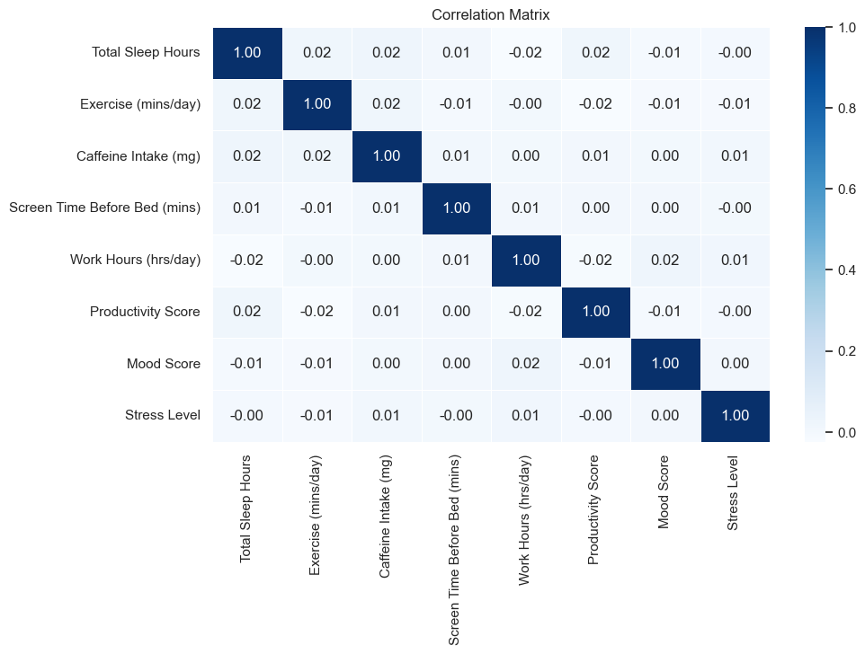

# Taller 2 - Analisis Univariado

## Miembros

- Katherin
- Heberth Martinez
- Diana
- Natalia

## Introduccion

## Seleccion de variables

## Importancia de las variabless

## Descripcion del codigo

## Interpretacion

## Conclusiones

- Conclusion de prueba 1
