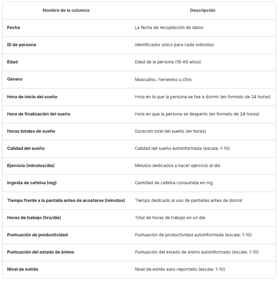

# 🌙 Taller 2: Análisis Exploratorio Univariable 💤

## Integrantes:

- Katherin Escobar
- Heberth Martinez
- Diana Mazuera
- Natalia Santamaria

## Introducción

La base de datos de "Ciclo de sueño y productividad" analiza los hábitos de sueño y su impacto en la productividad, el estado de ánimo y los niveles de estrés.

Se cuenta con 5000 registros que abarcan personas entre los 18 y 60 años de edad y sus distintos estilos de vida.

A continuación, está la descripción de cada columna de la base de datos:

## Selección de variables

El análisis realizado se hizo con el fin de identificar la característica que tuviera una mayor relación con la variable objetivo "Productivity Score", por lo que se empezó una revisión de la base de datos detectando que estamos frente a un problema de clasificación con variables no lineales, y no se cuentan con datos atípicos, nulos o faltantes.

## Importancia de las variables

En la dinámica actual, donde la tecnología y el ritmo acelerado dominan las rutinas, es crucial mantener la productividad y el bienestar.Teniendo en cuenta diferente literatura se observa que el sueño y el ejercio son fundamentales para la salud humana, afectando no solo el bienestar físico sino también la capacidad mental y cognitiva. Autores como Dement y Vaughan (1999), Van Dongen y otros (2003), Turner y otros (2007) demuestran que el sueño se relaciona con el desempeño cognitivo, la toma de decisiones, el razonamiento, la memoria, la solución de problemas, la atención e incluso los accidentes.

Tomando en cuenta no solo la literatura previa, sino también la correlación de los datos, se determina que las mejores características son "Total Sleep Hours" y "Exercise"

## Descripcion del código

### Resumen del Análisis de Datos y Modelado con Regularización

#### Carga y Exploración del Dataset

En la primera sección, se carga el conjunto de datos en un `DataFrame` de `pandas`. Posteriormente, se realiza una exploración preliminar que incluye:

- Visualización de las primeras filas con `df.head()`.
- Inspección de la estructura del dataset con `df.info()`.
- Cálculo de estadísticas descriptivas con `df.describe()`.
- Detección de valores nulos mediante `df.isnull().sum()`.

Esto permite obtener una comprensión inicial de las características y posibles problemas del dataset.

#### Análisis Exploratorio de Datos

Se emplean diversas técnicas de visualización para entender la distribución de los datos y sus relaciones:

1. **Pairplot con Seaborn**: Se genera un `sns.pairplot(df)` para visualizar la distribución de variables y su relación entre sí.
2. **Box Plot Interactivo con Plotly**: Se usa `plotly.express.box()` para representar la distribución de cada variable de manera interactiva.

#### Cálculo de Correlaciones y Selección de Variables Relevantes

Se utiliza la correlación de Pearson para medir la relación entre las variables y la variable objetivo. El proceso es el siguiente:

- Se calcula la matriz de correlación con `df.corr()`.
- Se genera un `heatmap` con `seaborn` para visualizar los coeficientes de correlación.
- Se identifican las dos variables con mayor correlación con la variable objetivo.

#### Normalización y Revisión de Correlaciones

Para evaluar cómo afecta la normalización a la correlación de las variables, se aplican dos métodos de escalado:

1. **StandardScaler**: Normaliza los datos a una distribución con media 0 y desviación estándar 1.
2. **MinMaxScaler**: Escala los datos en un rango de 0 a 1.

Después de la normalización, se recalcula la matriz de correlación para analizar posibles cambios.

#### Análisis Estadístico Descriptivo

Se calculan diversas métricas estadísticas, incluyendo:

- Media y mediana.
- Moda y percentiles.
- Rango intercuartílico.

Estas estadísticas ayudan a comprender la dispersión y distribución de los datos.

#### Modelado con Regresión Logística Regularizada

Se implementa una **regresión logística con ElasticNet y validación cruzada** (`LogisticRegressionCV`) para evaluar la importancia de las variables. El flujo es el siguiente:

1. **División en conjunto de entrenamiento y prueba** usando `train_test_split()` con `stratify=y`.
2. **Normalización de datos** mediante `StandardScaler`.
3. **Entrenamiento del modelo** con regularización ElasticNet (`penalty='elasticnet'`, `solver='saga'`).
4. **Evaluación de la precisión del modelo** con `accuracy_score()`.
5. **Extracción de los coeficientes** para identificar las variables más relevantes.

## Interpretacion

\*Al evaluar las variables, se identifica que hay una baja correlación entre ellas. De esta manera, se procedió a realizar una técnica de regularización para determinar cuáles son las mejores características de nuestra base de datos, confirmando que las mejores son "Total Sleep Hours", "Exercise", y "Work Hours". Datos que tienen concordancia con la matriz de correlación.

## 📌 Conclusiones

1️⃣ **La correlación no siempre indica las mejores características**

- Se debe identificar qué tipo de relación hay entre las variables para escoger el método de correlación que más se ajuste a los datos.
- Aunque las variables con mayor correlación con la variable objetivo pueden ser candidatas para el modelo, **no significa que sean las más relevantes**.
- La regularización en la regresión logística mostró que otras variables también pueden tener un impacto significativo, incluso si su correlación era menor.

2️⃣ **La normalización no afecta el análisis realizado**

- La transformación de los datos con **StandardScaler** y **MinMaxScaler** no cambió la relación entre variables.
- La correlación entre las variables y la selección de características se mantuvieron consistentes antes y después de la normalización.

3️⃣ **El uso de técnicas de regularización es clave para la selección de variables**

- Aplicar **ElasticNet con validación cruzada** nos permitió ver qué variables realmente aportan información útil al modelo.
- Algunas variables que parecían importantes por su correlación fueron descartadas por la regularización.

4️⃣ **La validación cruzada ayuda a evitar el sobreajuste**

- Usar **cross-validation (CV)** nos aseguró que los resultados no dependieran solo de un conjunto de datos específico.
- Esto hizo que el modelo sea más **robusto y generalizable**.

5️⃣ **El análisis exploratorio de datos es fundamental antes de modelar**

- Visualizaciones como **pairplot (Seaborn)** y **boxplots interactivos (Plotly)** nos ayudaron a entender la distribución y relaciones de las variables.
- Detectamos posibles **outliers** y patrones que podrían afectar la predicción.

6️⃣ **El preprocesamiento influye en el desempeño del modelo**

- Técnicas como la normalización y la eliminación de valores nulos o inconsistentes **mejoran la estabilidad del modelo**.
- Un mal preprocesamiento puede afectar los coeficientes y la interpretación de la regresión logística.

7️⃣ **No todas las variables tienen impacto en la predicción**

- Algunas variables fueron eliminadas por el modelo debido a su coeficiente **cercano a 0** tras la regularización.
- Esto confirma la importancia de **no depender solo de la intuición o la correlación**, sino de probar diferentes enfoques para seleccionar las mejores características.

🔎 **Conclusión general:**  
El análisis de correlación es un buen punto de partida, pero es fundamental utilizar técnicas como la **regresión con regularización** para validar la importancia real de cada variable. La normalización ayuda a mejorar la estabilidad numérica del modelo, pero no modifica el análisis de importancia de características. **Usar validación cruzada y preprocesamiento adecuado mejora la capacidad del modelo para generalizar su desempeño al contar nuevos datos.** 🚀
