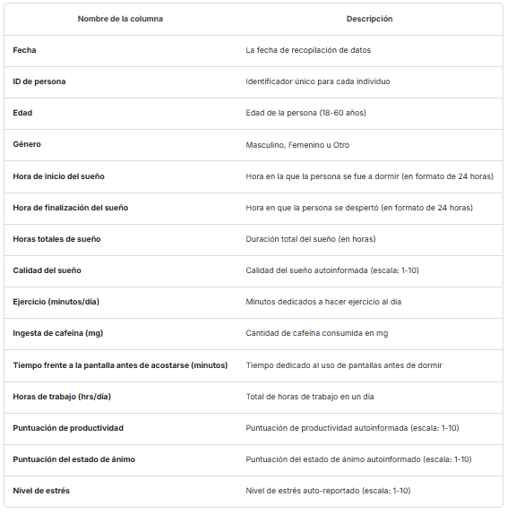

# 🌙 Taller 3: Análisis Exploratorio Bivariado 💤

## Integrantes:

- Katherin Escobar
- Heberth Martinez
- Diana Mazuera
- Natalia Santamaria

## Introducción

La base de datos de "Ciclo de sueño y productividad" analiza los hábitos de sueño y su impacto en la productividad, el estado de ánimo y los niveles de estrés.

Se cuenta con 5000 registros que abarcan personas entre los 18 y 60 años de edad y sus distintos estilos de vida.

A continuación, está la descripción de cada columna de la base de datos:

## Pregunta SMART

¿Qué impacto tiene el total de horas de sueño en la productividad de los trabajadores?

## Selección de variables

El análisis realizado se hizo con el fin de identificar la característica que tuviera una mayor relación con la variable objetivo "Productivity Score", por lo que se empezó una revisión de la base de datos detectando que estamos frente a un problema de clasificación con variables no lineales, y no se cuentan con datos atípicos, nulos o faltantes.

## Importancia de las variables

En la dinámica actual, donde la tecnología y el ritmo acelerado dominan las rutinas, es crucial mantener la productividad y el bienestar. Teniendo en cuenta diferente literatura se observa que el sueño y el ejercio son fundamentales para la salud humana, afectando no solo el bienestar físico sino también la capacidad mental y cognitiva. Autores como Dement y Vaughan (1999), Van Dongen y otros (2003), Turner y otros (2007) demuestran que el sueño se relaciona con el desempeño cognitivo, la toma de decisiones, el razonamiento, la memoria, la solución de problemas, la atención e incluso los accidentes.

Tomando en cuenta no solo la literatura previa, sino también la correlación de los datos, se determina que las mejores características son "Total Sleep Hours" y "Exercise".

## Descripcion del código

### Resumen del Análisis de Datos y Modelado con Regularización

#### Carga y Exploración del Dataset

En la primera sección, se carga el conjunto de datos en un `DataFrame` de `pandas`. Posteriormente, se realiza una exploración preliminar que incluye:

- Visualización de las primeras filas con `df.head()`.
- Inspección de la estructura del dataset con `df.info()`.
- Cálculo de estadísticas descriptivas con `df.describe()`.
- Detección de valores nulos mediante `df.isnull().sum()`.

Esto permite obtener una comprensión inicial de las características y posibles problemas del dataset.

#### Análisis Exploratorio de Datos

Se emplean diversas técnicas de visualización para entender la distribución de los datos y sus relaciones:

1. **Pairplot con Seaborn**: Se genera un `sns.pairplot(df)` para visualizar la distribución de variables y su relación entre sí.
2. **Box Plot Interactivo con Plotly**: Se usa `plotly.express.box()` para representar la distribución de cada variable de manera interactiva.

#### Cálculo de Correlaciones y Selección de Variables Relevantes

Se utiliza la correlación de Pearson para medir la relación entre las variables y la variable objetivo. El proceso es el siguiente:

- Se calcula la matriz de correlación con `df.corr()`.
- Se genera un `heatmap` con `seaborn` para visualizar los coeficientes de correlación.
- Se identifican las dos variables con mayor correlación con la variable objetivo.

#### Normalización y Revisión de Correlaciones

Para evaluar cómo afecta la normalización a la correlación de las variables, se aplican dos métodos de escalado:

1. **StandardScaler**: Normaliza los datos a una distribución con media 0 y desviación estándar 1.
2. **MinMaxScaler**: Escala los datos en un rango de 0 a 1.

Después de la normalización, se recalcula la matriz de correlación para analizar posibles cambios.

#### Análisis Estadístico Descriptivo

Se calculan diversas métricas estadísticas, incluyendo:

- Media y mediana.
- Moda y percentiles.
- Rango intercuartílico.

Estas estadísticas ayudan a comprender la dispersión y distribución de los datos.

#### Modelado con Regresión Logística Regularizada

Se implementa una **regresión logística con ElasticNet y validación cruzada** (`LogisticRegressionCV`) para evaluar la importancia de las variables. El flujo es el siguiente:

1. **División en conjunto de entrenamiento y prueba** usando `train_test_split()` con `stratify=y`.
2. **Normalización de datos** mediante `StandardScaler`.
3. **Entrenamiento del modelo** con regularización ElasticNet (`penalty='elasticnet'`, `solver='saga'`).
4. **Evaluación de la precisión del modelo** con `accuracy_score()`.
5. **Extracción de los coeficientes** para identificar las variables más relevantes.

### Resumen del Análisis de Datos y Modelado con Regularización

#### Carga y Exploración del Dataset

En la primera sección, se carga el conjunto de datos en un `DataFrame` de `pandas`. Posteriormente, se realiza una exploración preliminar que incluye:

- Visualización de las primeras filas con `df.head()`.
- Inspección de la estructura del dataset con `df.info()`.
- Cálculo de estadísticas descriptivas con `df.describe()`.
- Detección de valores nulos mediante `df.isnull().sum()`.

Esto permite obtener una comprensión inicial de las características y posibles problemas del dataset.

#### Análisis Exploratorio de Datos

Se emplean diversas técnicas de visualización para entender la distribución de los datos y sus relaciones:

1. **Pairplot con Seaborn**: Se genera un `sns.pairplot(df)` para visualizar la distribución de variables y su relación entre sí.
2. **Box Plot Interactivo con Plotly**: Se usa `plotly.express.box()` para representar la distribución de cada variable de manera interactiva.

#### Cálculo de Correlaciones y Selección de Variables Relevantes

Se utiliza la correlación de Pearson para medir la relación entre las variables y la variable objetivo. El proceso es el siguiente:

- Se calcula la matriz de correlación con `df.corr()`.
- Se genera un `heatmap` con `seaborn` para visualizar los coeficientes de correlación.
- Se identifican las dos variables con mayor correlación con la variable objetivo.

#### Normalización y Revisión de Correlaciones

Para evaluar cómo afecta la normalización a la correlación de las variables, se aplican dos métodos de escalado:

1. **StandardScaler**: Normaliza los datos a una distribución con media 0 y desviación estándar 1.
2. **MinMaxScaler**: Escala los datos en un rango de 0 a 1.

Después de la normalización, se recalcula la matriz de correlación para analizar posibles cambios.

#### Análisis Estadístico Descriptivo

Se calculan diversas métricas estadísticas, incluyendo:

- Media y mediana.
- Moda y percentiles.
- Rango intercuartílico.

Estas estadísticas ayudan a comprender la dispersión y distribución de los datos.

#### Modelado con Regresión Logística Regularizada

Se implementa una **regresión logística con ElasticNet y validación cruzada** (`LogisticRegressionCV`) para evaluar la importancia de las variables. El flujo es el siguiente:

1. **División en conjunto de entrenamiento y prueba** usando `train_test_split()` con `stratify=y`.
2. **Normalización de datos** mediante `StandardScaler`.
3. **Entrenamiento del modelo** con regularización ElasticNet (`penalty='elasticnet'`, `solver='saga'`).
4. **Evaluación de la precisión del modelo** con `accuracy_score()`.
5. **Extracción de los coeficientes** para identificar las variables más relevantes.

## Interpretacion

El análisis se divide en tres etapas. La primera etapa, se enfoca en comprender las relaciones lineales entre diversas variables y la puntuación de productividad. Se observó que variables como las horas de sueño total, el ejercicio y la ingesta de cafeína presentaban correlaciones débiles con la productividad, sugiriendo, que, por sí solas, no logran predecir, de manera lineal la productividad.

Para profundizar en el estudio, se analizaron gráficos de dispersión que representaban la relación entre "Exercise (mins/day)" y "Productivity Score", así como entre "Total Sleep Hours" y "Productivity Score". En ambos casos, se observó una falta de correlación lineal, reforzando la idea de que ni la cantidad de ejercicio ni la cantidad de sueño, por sí solas, son determinantes clave de la productividad en el trabajo. Estos resultados sugieren que otros factores podrían estar influyendo en la productividad.

En la segunda etapa, se aplicaron técnicas de normalización de datos para evaluar cambios en los valores de las variables y su impacto en la correlación. Al comparar la matriz de correlación normalizada con la matriz de correlación original, se nota que las correlaciones entre la productividad y el ejercicio, así como entre la productividad y las horas de sueño, se mantienen después de la normalización. Lo anterior, refuerza la idea de que estas variables no tienen una relación lineal fuerte con la productividad. Además, los valores de correlación no experimentaron cambios significativos que alteraran las conclusiones principales, lo que indica que las relaciones entre las variables son “robustas” y no se ven afectadas significativamente por la escala de los datos.

Por último, en la tercera etapa, se utilizó un modelo de Regresión Logística con ElasticNet y validación cruzada para identificar las variables más relevantes en la predicción de la variable objetivo. El modelo ElasticNet seleccionó "Screen Time Before Bed (mins)" y "Total Sleep Hours" como las variables más importantes para predecir la productividad. Sin embargo, la precisión del modelo en el conjunto de prueba fue del 11%, lo que sugiere que, aunque estas variables tienen cierto impacto, el modelo lineal no captura completamente la relación. La baja precisión del modelo indica que se necesitan enfoques adicionales para mejorar la predicción de la variable objetivo.

## Hipótesis
Ho: No hay relación entre las horas de sueño y la productividad
Ha: si existe alguna relación entre las horas de sueño y la productividad

## Tabla de contingencia

| **Sleep Hours** | **Poor** | **Average** | **Good** | **Excelent** |
| :-------------: | :------: | :---------: | :------: | :----------: |
|     4.5-5.6     |   354    |     393     |   235    |     269      |
|     5.6-6.9     |   366    |     373     |   250    |     275      |
|     6.9-8.2     |   342    |     355     |   265    |     278      |
|     8.2-9.5     |   366    |     334     |   268    |     277      |

## 📌 Conclusiones

1️⃣La relación entre los patrones de sueño y la productividad parece ser más compleja de lo que se suponía en un principio, se podría considerar incluir otras características relevantes (ej Hábitos alimenticios, entorno de trabajo, satisfacción laboral)

